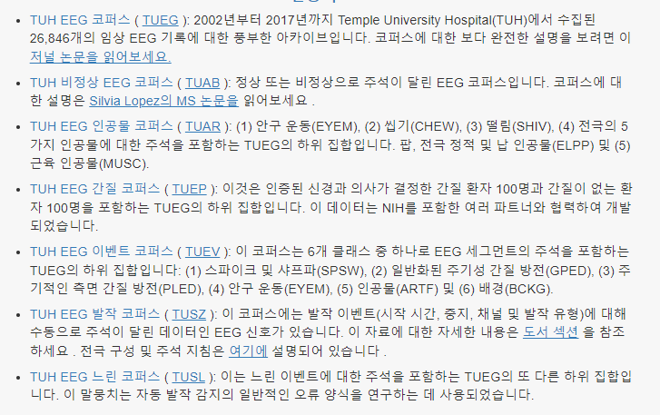

# Signal-DQ

# Signal Data Quality Management & Assessment and Adjust AI Model

# Dataset
## (1) ECG
## (2) EEG _ TUF 신청 완료

# Quality managemented Data
1. 품질관리 전 데이터 Model 적용
2. 품질관리 후 데이터 Model 적용

## Data Quality Management Method
https://journals.iucr.org/d/issues/2006/01/00/ba5084/index.html
https://ieeexplore.ieee.org/abstract/document/6412778
chrome-extension://efaidnbmnnnibpcajpcglclefindmkaj/http://pe.org.pl/articles/2013/4/60.pdf
https://iopscience.iop.org/article/10.1088/0967-3334/33/9/1449/meta

## Data Quality Assessment Method
https://lydus.org/project-detail.html?lang=ko&id=0c617eec-b5e1-4503-bfc5-9e6932062b58&open=true
https://lydus.org/project-detail.html?lang=ko&id=9d1af2a9-29fc-475f-9ab6-2c0f0d49f81a&open=true

# Prediction Model
Machin Learning Model 
5 ~ 7 머신러닝 모델 적용

Before After

### 1. Classification
